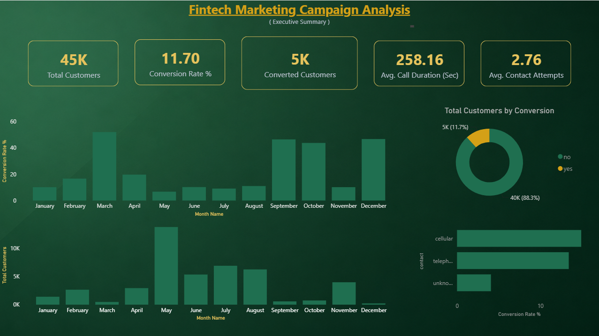
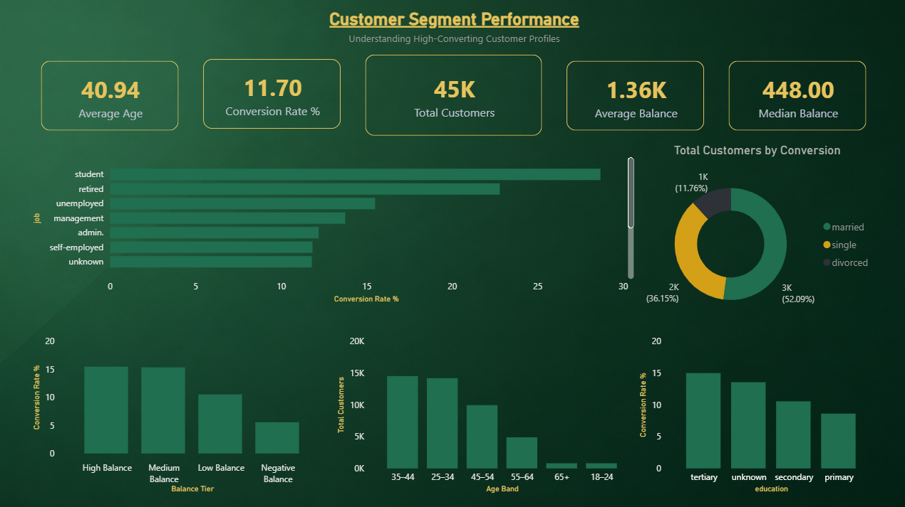
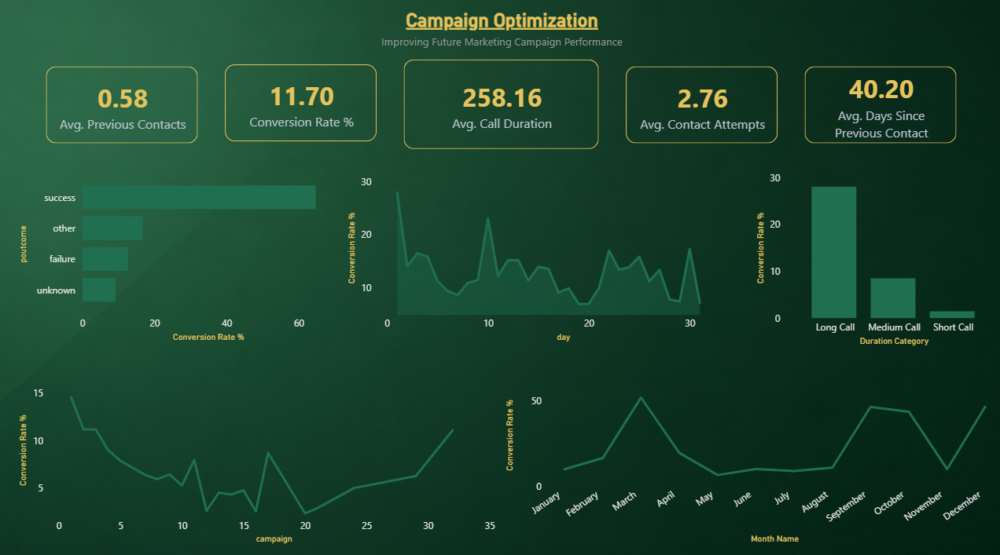

# Fintech Marketing Campaign Analysis

An end-to-end Business Analytics project demonstrating how SQL, AWS, Python, and Power BI can be used to evaluate a real-world bank marketing campaign and generate actionable business recommendations.

The project simulates a marketing analytics workflow commonly performed by Data Analysts and Business Analysts in financial services organizations such as American Express, Visa, Mastercard, and leading fintech companies.

---

## Project Status

**Current Release:** Version 1.0 ✅

### Completed

- AWS S3 Data Lake
- AWS Athena SQL Analysis
- Python Exploratory Data Analysis
- Power BI Executive Dashboard
- Business Recommendations
- GitHub Documentation

---

## Project Objective

The objective of this project is to analyze a bank marketing campaign, identify high-converting customer segments, evaluate campaign effectiveness, and recommend strategies for improving future marketing performance.

The project combines SQL, cloud technologies, Python, and Power BI into a complete analytics workflow.

---

## Business Requirements & Scope

**Business Ask:** Marketing and product stakeholders needed visibility into which customer segments and campaign tactics were driving (or limiting) term deposit conversions, in order to prioritize future campaign spend and contact strategy.

**Requirements identified:**
- Define a measurable conversion baseline (KPI: overall conversion rate)
- Segment-level conversion visibility (age, occupation, education, marital status, balance tier)
- Campaign execution factors affecting conversion (contact frequency, channel, call duration, timing)
- Historical campaign outcome as a predictive input for future targeting

**KPIs tracked:**
- Overall conversion rate
- Segment-wise conversion rate
- Contact-attempt-to-conversion ratio
- Channel effectiveness rate
- Call duration vs. conversion relationship

This scope was translated into 13 documented SQL business queries (see SQL Analysis) and a three-page Power BI dashboard structured around Executive Summary, Segment Performance, and Campaign Optimization — mapping each requirement to a corresponding analytical deliverable.

---

## Dataset

**Source:** UCI Machine Learning Repository – Bank Marketing Dataset

**Records:** 45,211

**Features:** 17 customer demographic, financial, and campaign attributes.

**Target Variable:** Customer subscription to a term deposit (`y`).

---

## Tech Stack

| Category | Tools |
|----------|-------|
| Cloud Storage | AWS S3 |
| SQL | AWS Athena |
| Programming | Python |
| Data Analysis | Pandas, NumPy |
| Visualization | Matplotlib, Seaborn |
| Dashboard | Power BI |
| Version Control | Git & GitHub |

---

## Business Problem

Financial institutions invest significant resources in marketing campaigns, yet only a small percentage of customers respond positively.

The objective of this project is to identify:

- Which customer segments are most likely to convert
- Which campaign strategies produce the highest conversion rates
- Which operational changes can improve future campaign performance

The final outcome is a set of data-driven recommendations supported by SQL analysis, Python exploration, and interactive Power BI dashboards.

---

## Project Architecture

```
Business Requirement
(Define KPIs & conversion drivers)
     │
     ▼
Raw CSV
     │
     ▼
 AWS S3 Bucket
     │
     ▼
 AWS Athena
(SQL Analysis)
     │
     ▼
Python Analysis
(Validation + EDA)
     │
     ▼
Power BI Dashboard
     │
     ▼
Business Recommendations
     │
     ▼
Stakeholder Review & Validation
```

---

## Repository Structure

```
fintech-marketing-campaign-analysis/

├── architecture/
├── data/
├── notebooks/
├── python/
├── query_results/
├── SQL/
├── visuals/
├── README.md
└── requirements.txt
```

---

## SQL Analysis

Business questions answered using AWS Athena:

- Overall campaign conversion rate
- Conversion by age segment
- Conversion by occupation
- Conversion by marital status
- Conversion by education
- Contact frequency analysis
- Account balance tier analysis
- Communication channel effectiveness
- Monthly campaign performance
- Daily campaign performance
- Previous campaign outcome analysis
- Best-performing customer segments
- Call duration analysis

---

## Python Analysis

Python was used to perform supporting exploratory analysis, including:

- Dataset validation
- Statistical summaries
- Correlation analysis
- Distribution analysis
- Boxplot comparisons
- Customer profiling

---

## Data Validation & Quality Checks

Before finalizing insights, outputs were validated at each stage of the pipeline:

- Verified AWS Athena query outputs against raw dataset aggregates to confirm SQL logic accuracy
- Cross-checked Python EDA statistical summaries against Power BI visual aggregations for consistency
- Reviewed edge cases (e.g., "unknown" communication channel, zero-duration calls) to confirm they were handled correctly rather than skewing conversion metrics
- Confirmed dashboard KPIs reconciled with underlying SQL results before finalizing recommendations

---

## Power BI Dashboard

The dashboard is designed for executive-level decision making and consists of three interactive pages.

### Page 1 — Executive Summary

Provides a high-level overview of campaign performance through key performance indicators, conversion trends, communication channel analysis, and campaign volume.
location: 

### Page 2 — Customer Segment Performance

Identifies high-performing customer groups by analyzing conversion rates across age bands, occupation, education level, marital status, and account balance tiers.
location: 

### Page 3 — Campaign Optimization

Evaluates campaign execution by examining contact frequency, call duration, previous campaign outcomes, and seasonal trends to support strategic marketing decisions.
location: 

---

## Project Deliverables

- AWS S3 cloud data storage
- AWS Athena SQL environment
- 13 documented SQL business queries
- Modular Python analysis package
- Professional Jupyter Notebook
- Three-page Power BI dashboard
- Executive business recommendations
- Complete GitHub documentation

---

## Key Findings

- The overall marketing campaign achieved a **conversion rate of 11.70%**, establishing the baseline for campaign performance.
- **Students (28.68%)** and **retired customers (22.79%)** demonstrated the highest conversion rates among customer segments.
- Customers with **medium and high account balances** converted significantly more often than those with low or negative balances.
- **Cellular communication** proved substantially more effective than unknown communication channels.
- Customers with a **successful previous campaign interaction** exhibited the highest likelihood of converting again.
- The **first contact attempt** delivered the strongest conversion performance, with conversion rates declining as additional contact attempts increased.
- **Longer customer conversations** showed a strong positive relationship with successful campaign outcomes.
- Correlation analysis indicated that customer behaviour is influenced more by **segment characteristics and campaign strategy** than by strong linear relationships among numerical variables.

---

## Business Recommendations

Based on the analysis, the following actions are recommended to improve future marketing campaign performance:

1. **Prioritize High-Converting Customer Segments**
   - Allocate a larger share of campaign resources toward students, retired customers, and customers maintaining medium to high account balances, as these groups consistently achieved above-average conversion rates.

2. **Optimize Contact Strategy**
   - Focus on maximizing the effectiveness of the initial customer interaction rather than increasing the number of follow-up calls, since conversion rates decline noticeably after the first few contact attempts.

3. **Improve Communication Channel Selection**
   - Prioritize cellular communication wherever possible and reduce reliance on unknown or poorly documented communication channels.

4. **Leverage Previous Campaign History**
   - Incorporate previous campaign outcomes into customer targeting strategies by giving higher priority to customers who responded positively to earlier marketing campaigns.

5. **Increase Customer Engagement Quality**
   - Emphasize meaningful customer conversations through improved agent training and personalized communication, as longer and more engaging calls were consistently associated with higher conversion rates.

---

## Future Improvements

### Version 2 Roadmap

The next version of this project will extend the current descriptive analytics workflow into a more advanced business analytics solution by introducing:

- Customer segmentation using clustering techniques (K-Means)
- Campaign ROI and marketing budget optimization analysis
- Interactive Power BI dashboard enhancements with drill-through functionality
- Automated data pipeline integrating AWS S3, Athena, and Power BI refresh
- Performance comparison across multiple marketing campaign scenarios

---

## Author

**Meenansh Chauhan**

Business Analytics • Data Analytics • SQL • Python • Power BI • AWS

If you found this project interesting, feel free to explore the repository, review the SQL queries, and interact with the Power BI dashboard.